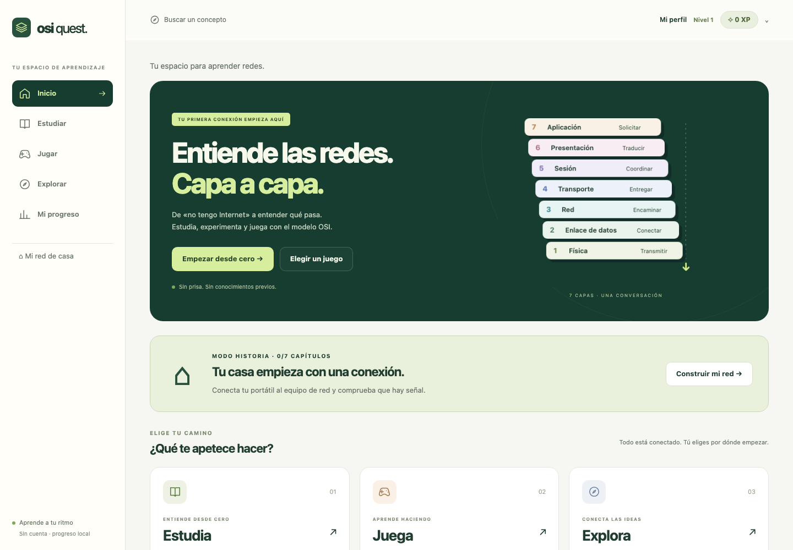
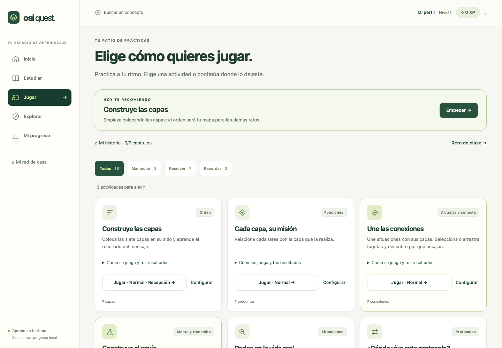
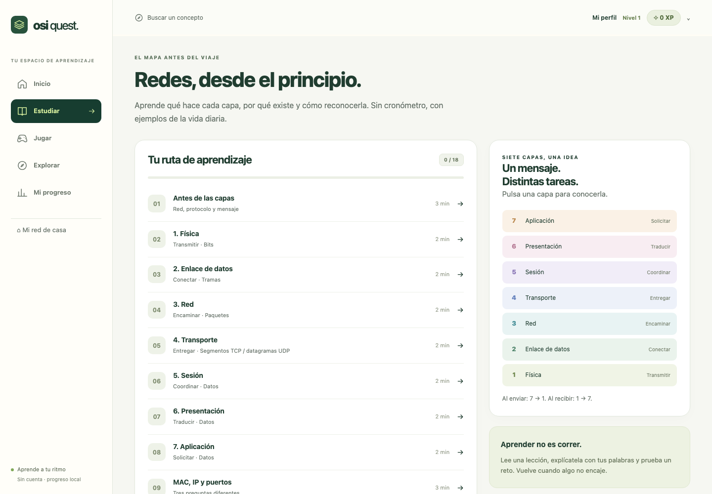
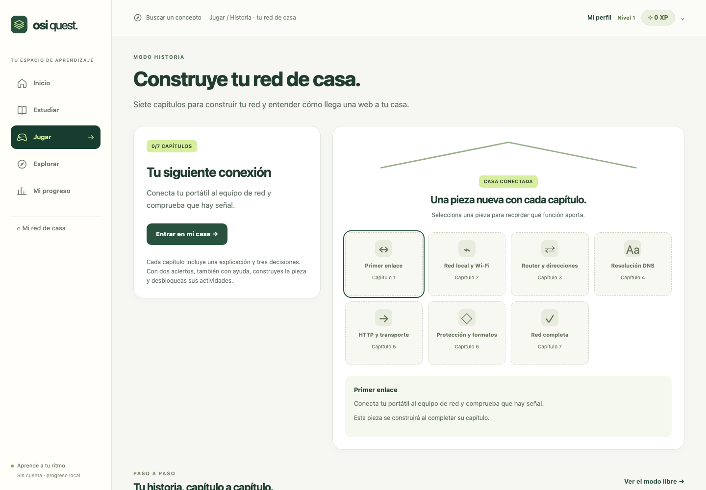
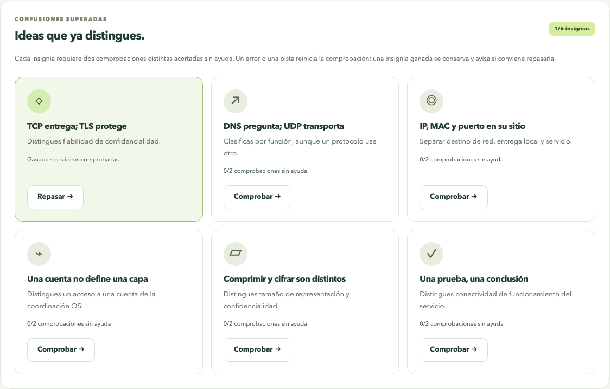
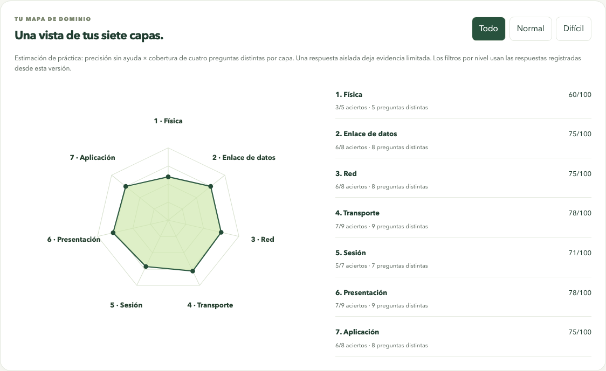
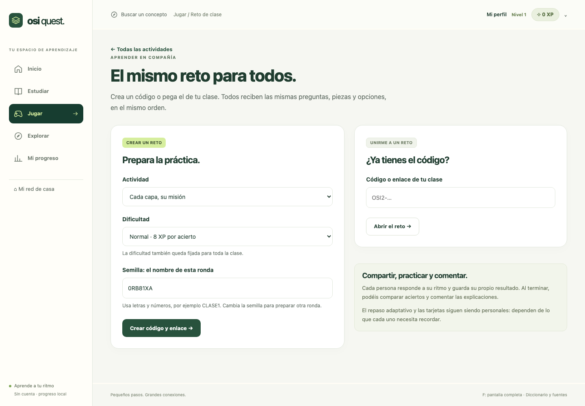

# OSI Quest

Una app en español para aprender redes desde cero: entender el modelo OSI, practicar sus siete capas y conectar la teoría con situaciones reales.



## Qué puedes hacer

La versión 3.8 añade instalación/offline, temas, inspector hexadecimal, sprint de 60 segundos y práctica por capa. [Guía y cierre de revisión](docs/VERSION-3.8.md).

- **Construir tu red de casa:** una historia de siete capítulos, con explicaciones, ejemplos cotidianos y 21 decisiones. Cada pieza construida desbloquea actividades.
- **Estudiar:** 18 lecciones con ejemplos cotidianos, índice por secciones, marcador de lectura, notas para explicarlo con tus palabras y comprobaciones sin XP. Puedes marcar una lección para releerla y retomar donde lo dejaste.
- **Jugar:** 15 actividades: orden de capas, conexiones entre tareas y capas, construcción de un envío, funciones, situaciones, protocolos, tres casos guiados, repaso adaptativo, tarjetas, examen, supervivencia, duelo por turnos, confusiones superadas, sprint de 60 segundos y práctica de una capa.
- **Encontrar tu actividad:** filtros persistentes, pendientes de repaso, recomendaciones y tu mejor y último resultado. Inicia con tus últimos ajustes o abre Configurar; cada actividad conserva sus preferencias.
- **Elegir dificultad:** normal para empezar; difícil con confusiones habituales explicadas al responder. Las tarjetas y los casos tienen su propio recorrido guiado.
- **Practicar en clase:** crea o pega un código para recibir el mismo reto, con las mismas preguntas y opciones en el mismo orden.
- **Explorar:** envolturas TCP/IP/Ethernet, viaje de un mensaje y diccionario de 28 términos con referencias.
- **Medir tu progreso:** XP, niveles cada 200 XP, radar de las siete capas, seis insignias de comprensión, historial con tiempo, repasos programados y exportación/importación de copias.

El banco contiene **181 preguntas de actividad**, incluidas 9 decisiones de casos, más **24 comprobaciones de confusiones** y **21 decisiones de historia: 226 en total**. Funciones, situaciones y protocolos difíciles cuentan con tres variantes por capa y explicaciones de sus alternativas. El examen incluye 15 preguntas y cubre las siete capas. No muestra las soluciones hasta entregar; permite cambiar respuestas y marcar dudas.

**Une las conexiones** añade 28 variantes de asociación: dos situaciones por capa y dificultad. Cada ronda propone siete conexiones, que puedes resolver seleccionando tarjetas y capas o arrastrándolas. **Construye el envío** recorre seis etapas de una petición HTTP sobre TCP, IPv4 y Ethernet: petición, puerto, entrega fiable, destino IP, siguiente salto local y señales. Las piezas y sus explicaciones muestran cómo encajan las funciones; el ejemplo es una simulación conceptual y no envía tráfico real.



## Experiencia y niveles

| Resultado            | Normal | Difícil |
| -------------------- | -----: | ------: |
| Acierto sin ayuda    |   8 XP |   20 XP |
| Acierto con ayuda    |   4 XP |   10 XP |
| Respuesta incorrecta |   0 XP |    0 XP |

En los retos de orden, conexiones y construcción del envío, acertar tras un error cuenta como ayuda solo en ese paso. Cada 200 XP subes un nivel. Las tarjetas son de autoevaluación y no suman XP; los casos guiados usan las recompensas de normal. El progreso anterior se conserva.

La ronda muestra puntos: **✓ verde** para aciertos, **✗ coral** para errores y **◐ ámbar** para ayuda o recuperación. Al responder aparece la etiqueta de su capa y un minimapa con esa capa resaltada. En el examen, los puntos solo indican respuestas guardadas hasta entregar; en el duelo se revelan después de ambos turnos.

La **X** abre un panel con **Pausar**, **Salir y perder la ronda** y **Seguir jugando**. Pausar permite volver desde Jugar y conserva la sesión mientras la página siga abierta. Salir descarta la ronda y sus resultados pendientes; los intentos de práctica ya guardados permanecen. El navegador avisa al intentar recargar una ronda abierta. Las preguntas reservan espacio para sus respuestas y usan un fundido de 150 ms, desactivado cuando se prefiere menos movimiento.

En móvil, «Siguiente» y el acceso a la explicación están siempre al alcance. Las respuestas reveladas siguen disponibles con teclado y distinguen la correcta y tu error con texto y símbolos. Las lecciones prácticas recorren una URL, Wi-Fi, los equipos de casa, velocidad, seguridad y errores del navegador.



## Tu red de casa, capítulo a capítulo



Comienza con el cable y la señal; incorpora Wi-Fi y red local, router y direcciones, DNS, petición web y transporte, protección y formatos, y diagnóstico de la red completa. Cada capítulo explica la idea con una situación y una analogía del día a día. Después decides qué hacer en tres preguntas con pistas y explicación. Dos aciertos permiten construir la pieza y abrir sus actividades.

## Nuevas formas de practicar

**Supervivencia:** empieza con tres vidas y responde hasta 20 preguntas distintas del nivel elegido. Un error cuesta una vida; al perder la tercera termina la ronda después de leer la explicación. Puedes activar **Contrarreloj**: 30 segundos por pregunta. Agotar el tiempo cuesta una vida y no suma XP. El reloj de la pregunta se detiene durante las explicaciones, las pausas, otras pantallas y las pestañas ocultas.

**Duelo por turnos:** dos personas comparten dispositivo y reciben las mismas siete preguntas y opciones. La pantalla para pasar el móvil oculta la pregunta y la primera respuesta; las soluciones se muestran después de que ambos contesten. Se alterna quién responde primero y cada acierto vale un punto. El marcador se guarda localmente con nombres anónimos (Jugador A/B); los nombres escritos solo duran en la sesión y no se exportan; no alteran los XP, la precisión ni la dificultad del perfil. Cada persona puede repetir solo sus errores, también sin modificar el perfil.



**Confusiones superadas:** seis insignias, entre ellas «TCP entrega; TLS protege». Cada una exige dos preguntas distintas acertadas sin ayuda. Repetir la misma pregunta no basta. Un error o una pista reinicia la comprobación y requiere esperar diez minutos antes de aportar nueva evidencia; si ya tenías la insignia, la conservas con un aviso para repasarla. Puedes practicar cada idea desde el perfil o todas juntas desde Jugar.



**Radar por capa:** consulta todo el historial de preguntas o filtra por normal y difícil. La estimación combina precisión sin ayuda y cobertura: para alcanzar toda la cobertura hacen falta cuatro preguntas distintas de esa capa. Una sola respuesta correcta deja evidencia limitada. Los filtros por dificultad usan solo respuestas registradas desde esta versión; el progreso anterior permanece en «Todo». Es una orientación para practicar, no una certificación.

**Resultados con contexto:** tiempo activo, diferencia en puntos de precisión frente a tu media previa y desglose por capa de errores, ayuda, preguntas en blanco y tiempo agotado. La media usa las rondas comparables de las últimas 30 guardadas: mismo modo, nivel, opción de reloj y tipo de repaso/clase; la ronda actual se excluye. Para clase se exige el mismo código; para casos, historia y orden, también el mismo caso, capítulo o dirección. Si no hay una ronda comparable, muestra un punto de partida. El tiempo activo incluye leer explicaciones y excluye pausas, pantallas distintas y pestañas ocultas.

**Repetir solo los fallos** recupera las preguntas, conexiones, capas o etapas concretas que fallaste o resolviste con ayuda. Conserva el recorrido y reutiliza las piezas ya acertadas sin puntuarlas otra vez. En tarjetas, recupera solo las que marcaste «Todavía no»; sus resultados siguen siendo autoevaluación. Los repasos de supervivencia son rondas de preguntas sin vidas ni reloj, para aprender con calma. El repaso del duelo conserva el aislamiento del perfil.

Los repasos desde **Repetir solo los fallos** son recuperación inmediata: dan hasta **4 XP en normal o 10 XP en difícil**, una vez por objetivo cada diez minutos. No cambian estadísticas, radar, insignias ni fechas de repaso. Mantienen alternativas, incluso con un único objetivo, y conservan el contexto del caso o capítulo. Repetir un capítulo ya construido tampoco suma XP ni cambia estadísticas. Completar de nuevo un capítulo pendiente poco después de responderlo usa recuperación; se puede construir con dos decisiones correctas de sus tres.

## Retos de clase



1. Entra en **Jugar → Crear o abrir un reto**.
2. Elige la actividad, la dificultad y una semilla como `CLASE1`.
3. Copia el código o el enlace y compártelo. Quien lo recibe puede pegarlo en esa misma pantalla.
4. Cada participante pulsa **Empezar este reto** y responde a su ritmo.

El código fija la actividad, la dificultad, el recorrido o caso elegido, la selección y el orden de las opciones. La versión 3.5 utiliza códigos **OSI2** por el nuevo banco y sus reglas de selección; los códigos OSI1 anteriores deben volver a crearse. Tu progreso personal se conserva. También comprueba la revisión del contenido: una copia diferente de la app muestra un aviso y no inicia un reto distinto en silencio. Reabrir el mismo código empieza una ronda nueva con el mismo contenido. Cambiar la semilla baraja una nueva ronda; con bancos finitos pueden repetirse preguntas. En orden, envío y casos, el recorrido educativo es fijo y se barajan sus opciones o piezas.

Los retos de clase conservan sus actividades de preguntas, examen, orden, conexiones, envío y casos. Los nuevos modos de supervivencia, duelo e insignias se abren desde sus propias tarjetas. Los retos de clase no dependen del historial personal. El repaso adaptativo y las tarjetas quedan fuera porque se adaptan a cada persona. Los resultados permanecen en cada navegador: no hay clasificación compartida, sincronización en directo ni recepción de notas por parte de un profesor.

Un enlace publicado funciona para toda la clase. Una dirección `127.0.0.1` solo funciona en el ordenador que sirve la app: en ese caso, comparte el **código** y usad copias de la misma versión, o publica primero en GitHub Pages.

## Arrancar en tu ordenador

Necesitas **Node.js 22 o posterior**. No se necesitan claves ni cuentas. La app publicada no tiene dependencias externas en tiempo de ejecución; esbuild se instala como herramienta de desarrollo para preparar la web.

```sh
npm ci --ignore-scripts
npm run dev
```

Abre `http://127.0.0.1:5173`. Si ese puerto está ocupado:

```sh
npm run dev -- --port 5180
```

La interfaz se adapta a ordenador, tableta y móvil. En las preguntas, **A–D** eligen la opción correspondiente. Los controles también se pueden usar con **Tab** y **Enter**, y las actividades de arrastre ofrecen selección por clic o toque. **Mayús+F** cambia la pantalla completa y **Esc** permite salir cuando el navegador lo admite. Los atajos no interfieren al escribir en campos de texto.

Los módulos JavaScript se deben servir mediante HTTP: no abras `index.html` directamente con doble clic.

## Comprobar y preparar la web

```sh
npm run verify
```

Comprueba la sintaxis, ejecuta las pruebas de contenido, selección de preguntas, sesiones, recompensas, progreso, repetición espaciada y retos reproducibles, y genera `dist/` para un alojamiento estático. Los recorridos de navegador de la entrega se documentan en [Validación](docs/VALIDACION.md).

También puedes ejecutarlo por separado:

```sh
npm run check
npm test
npm run build
```

En desarrollo, el navegador carga módulos ES nativos. La compilación usa esbuild para agrupar, comprimir y dividir las pantallas, con nombres de recursos versionados y rutas relativas. `dist/` contiene solo la web publicada, sin tests ni herramientas de desarrollo.

Las pruebas de navegador también están incluidas. Playwright está fijado como dependencia de desarrollo en el lockfile. Solo hace falta instalar su navegador para ejecutar estas pruebas; no forma parte de la web publicada:

```sh
npx playwright install chromium
```

Mantén `npm run dev` abierto en otra terminal y ejecuta:

```sh
npm run test:browser
```

La integración continua ejecuta estas mismas suites y `npm run test:production`, que comprueba recursos versionados, rutas de repositorio, cargas simultáneas y un presupuesto de carga inicial.

Las capturas y los informes se guardan en `work/browser-app/`, `work/browser-class/`, `work/browser-learning/` , `work/browser-story/`, `work/browser-accessibility/` y `work/browser-priorities/`. Si utilizas otro puerto o una ruta publicada, fija `OSI_TEST_URL` a la dirección completa de la app. Los tests usan navegadores aislados y no modifican el progreso de tu navegador habitual.

## Subir a GitHub

1. Descomprime el ZIP.
2. Crea un repositorio y sube **el contenido** de la carpeta `osi-quest`, incluyendo `.github`, `.gitignore` y los demás archivos ocultos. `package.json` debe quedar en la raíz del repositorio.
3. El flujo **Verificar** ejecutará pruebas de reglas y recorridos de Chromium en cada push y pull request.
4. Para publicar, abre **Settings → Pages → Build and deployment → Source → GitHub Actions**.
5. En **Actions**, ejecuta manualmente **Publicar en GitHub Pages** desde la rama principal. GitHub mostrará la dirección al acabar.

El proyecto usa rutas con `#` y recursos relativos: funciona también cuando Pages publica bajo `/nombre-del-repositorio/`. Las instrucciones de publicación siguen la [documentación de GitHub Pages](https://docs.github.com/en/pages/getting-started-with-github-pages/using-custom-workflows-with-github-pages).

La entrega es el proyecto preparado para GitHub. No se ha creado ni publicado un repositorio en una cuenta de GitHub.

## Organización

```text
src/
  app/            Arranque, navegación y estructura común
  components/     Piezas de interfaz compartidas
  data/           Lecciones, capas, preguntas, tarjetas y referencias
  domain/         Reglas del juego y selección/repaso, sin DOM
  features/       Pantallas y controles agrupados por función
  services/       Persistencia, validación de copias y descargas
  styles/         Diseño separado por pantalla y responsabilidad
scripts/          Servidor local, comprobación y compilación
tests/            Pruebas con el ejecutor nativo de Node.js
docs/             Arquitectura y validación
.github/workflows/ Verificación y publicación manual
```

Consulta [la arquitectura](docs/ARQUITECTURA.md) para ampliar el proyecto sin mezclar las responsabilidades.

## Guardado y privacidad

El progreso se almacena localmente en el navegador. No hay servidor de cuentas, analítica ni sincronización entre dispositivos. Puedes exportar una copia JSON e importarla; reemplazar o borrar el progreso siempre requiere confirmación.

Puedes exportar sin historial o borrar solamente las rondas conservando XP y lecciones. Si el guardado está dañado, se conserva el original, se ofrece descargarlo y se bloquea su sobrescritura automática. El checksum detecta daños accidentales; el esquema sigue validándose. Si no queda espacio, aparece un aviso para exportar lo que sigue en memoria.

Se conserva la clave de almacenamiento de las versiones anteriores y se migra el contenido válido al formato actual. Cambiar de navegador, origen o dispositivo crea un espacio de progreso diferente: utiliza una copia para trasladarlo. La pausa conserva una ronda en memoria y el navegador avisa antes de recargar. Una ronda en curso no se recupera después de recargar; los intentos de práctica ya registrados sí se conservan.

## Criterio educativo

OSI es un modelo conceptual, no siete programas separados. Se explican sus límites respecto a TCP/IP, TLS, Wi-Fi y Ethernet. Las preguntas difíciles se centran en errores de razonamiento; no dependen de enunciados ambiguos. Las fuentes aparecen en el diccionario de la app y en [Fuentes del contenido ampliado](docs/FUENTES.md).

## Revisión de auditorías

La entrega incorpora las correcciones relacionadas con esta ampliación. [Revisión de las auditorías](docs/AUDITORIAS.md) distingue los problemas corregidos, afirmaciones no reproducidas y mejoras pendientes. No declara resueltos todos los puntos de los informes.

## Rendimiento y seguridad

La pantalla inicial compilada carga dos módulos de JavaScript y un archivo de estilos. Las preguntas y las pantallas de estudio/juego se descargan al abrirlas; cada pantalla carga sus estilos. Inicio usa un catálogo de IDs, capas y tipos, sin respuestas. `npm run catalog` actualiza ese catálogo al cambiar el contenido y `npm run check` detecta si queda desfasado.

Las plantillas escapan los valores y el renderizador compartido sanitiza el HTML. CSP y Trusted Types refuerzan la protección; los controles de pruebas y el panel de diagnóstico solo están en desarrollo o en `dist-test`, que no se publica. Las copias se validan en un Worker; si su creación está bloqueada, se usa el mismo validador acotado en el hilo principal. La búsqueda del diccionario espera 150 ms y cancela trabajo al salir. Seleccionar piezas conserva los controles montados.

El build incluye un manifiesto de versión y ofrece actualizar al volver a una pestaña con una versión antigua. La precarga de sesiones respeta ahorro de datos y 2G. El aviso de salir solo se instala mientras hay una ronda pendiente.

`npm run test:production` prueba el build real sin hooks y una compilación instrumentada separada para verificar carreras de carga. `npm run test:stability` recorre 100 rondas y 600 navegaciones y comprueba listeners, DOM y heap tras calentamiento. La cobertura CSS se recoge como diagnóstico; no se eliminan reglas responsive solo porque un recorrido no las haya usado.

Consulta [Rendimiento](docs/RENDIMIENTO.md), [Seguridad](SECURITY.md) y [Configuración del repositorio](docs/GITHUB-SETUP.md). Todavía no hay repositorio: CODEOWNERS, contacto de seguridad, reglas de ramas y protecciones del entorno requieren tus datos reales al crearlo.

## Interfaz

Jugar reúne una recomendación, las 15 actividades en tarjetas compactas y un selector de capítulos. Cada tarjeta explica tres pasos al abrir su detalle. El perfil permite guardar nombre local, densidad cómoda/compacta y movimiento reducido. Los resultados proponen repetir fallos, otra ronda o subir a difícil según cómo te fue.

Los estilos de producción se comparan con desarrollo en cinco anchuras; la compilación impide duplicar grupos y respeta la misma cascada al visitar pantallas en diferente orden. Progreso y Clase usan metadatos y huellas generadas, sin cargar todo el banco. `npm run test:visual` y `npm run test:interface` forman parte de las pruebas de producción.

[Revisión y prioridades 3.7](docs/PRIORIDADES-3.7.md) detalla las 20 mejoras de interfaz y el estado de cada propuesta del adjunto. [Cambios](CHANGELOG.md) resume esta entrega.
